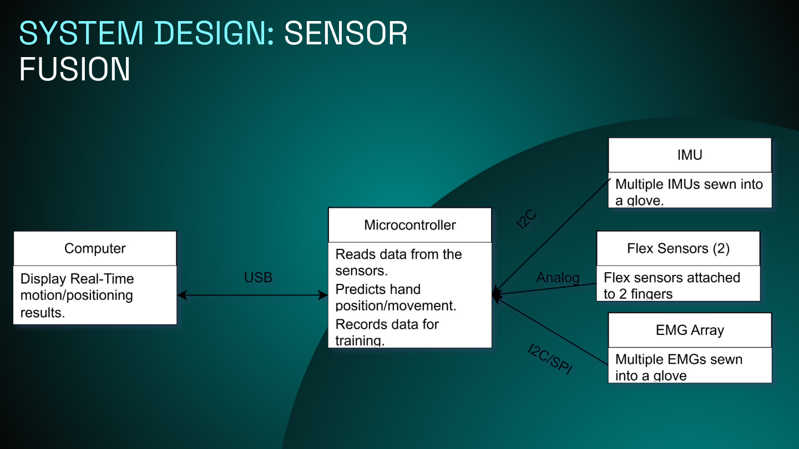
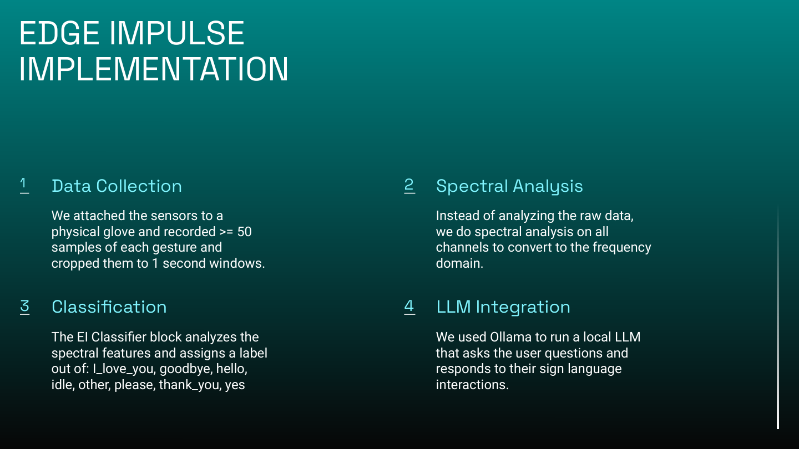
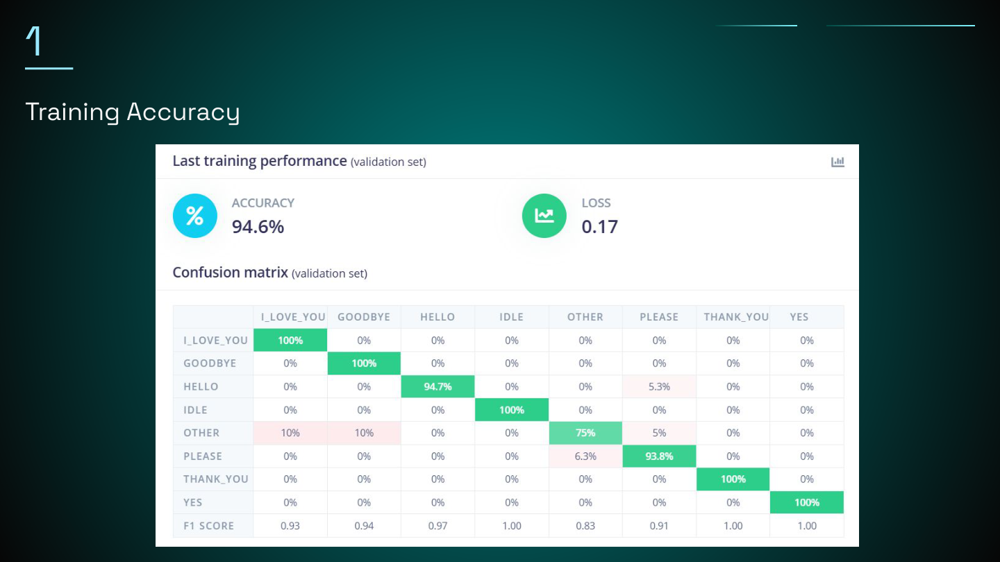
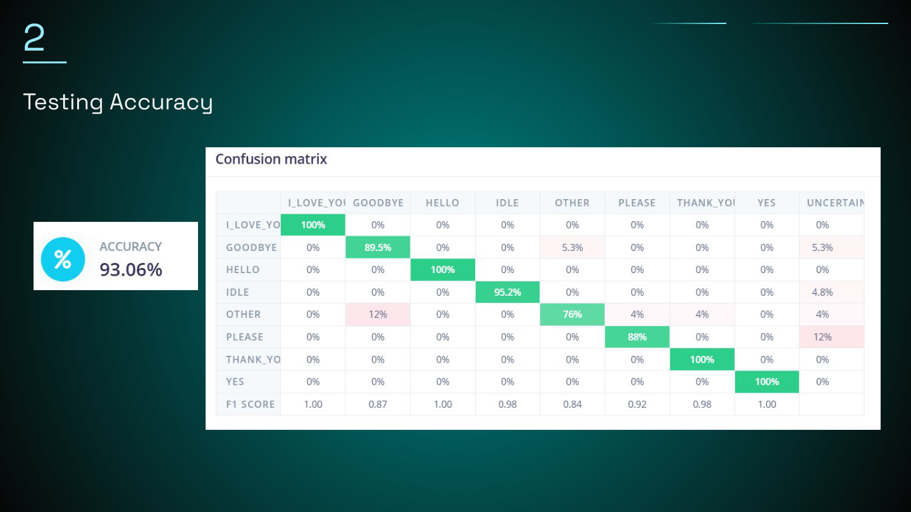
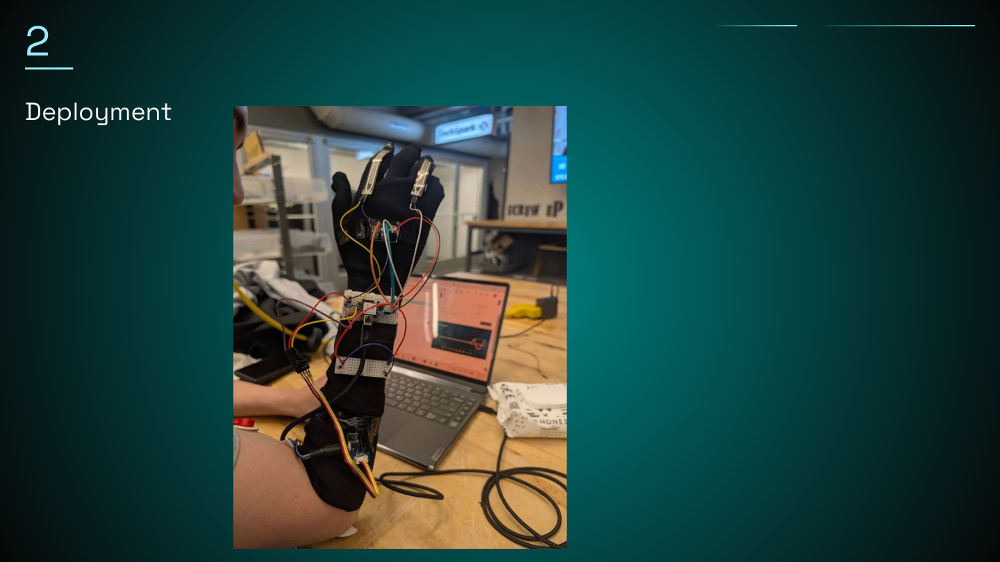

# Assistive Wearable Biosignal ML — EMG Sign-Language Glove (ESP32-S3)

## TL;DR
I built an ESP32-based wearable that acquires **EMG** plus motion/orientation features from **accelerometer+gyroscope + an external high-quality magnetometer**, and runs **on-device sign-language classification** in **embedded C**. I used **Edge Impulse** to create an end-to-end embedded ML workflow for dataset collection, training, evaluation, and deployment. Recently, I **integrated a higher-quality magnetometer** and **eliminated flex sensors**, and I am expanding from single words toward **more words and phrase-level decoding**.

**Links**
- **Code:** https://github.com/adwoama/SignLanguageLLM  
- **Demo:** 

> **Recommended assets to add to this repo:**  
> `assets/glove/demo_page_03.png` `demo_page_04.png` `demo_page_05.png` `demo_page_06.png` `demo_page_07.png`  
> `assets/glove/device.jpg` `assets/glove/block_diagram_v2.png`  
> *(optional)* `assets/glove/Demo.pdf` `assets/glove/confusion_matrix.png`

---

## Why this project
Camera-based sign recognition can be sensitive to lighting/background and raises privacy concerns. A wearable interface can be:
- **camera-free** (privacy),
- **low-latency** (interactive),
- **robust to environment** (works anywhere),
- and a practical platform for **assistive communication**.

The main technical challenges are **biosignal variability** (session drift, electrode placement) and **motion artifacts**.

---

## System overview
**Signal path:** EMG + inertial sensing → windowing/features → classifier → real-time output (**confidence gating + cooldown**).

### Design artifacts (from demo)

> **Version note:** The class demo slides show a v1 build that included flex sensors. The current iteration removes flex sensors and uses **EMG (Grove EMG Detector → ADS1115) + motion (MPU-9255 accel/gyro) + an external high-quality magnetometer (MMC5983MA)**.

---

## Hardware & sensing
- **MCU:** Seeed Studio **XIAO ESP32-S3**
- **EMG front-end:** Seeed **Grove EMG Detector** (SKU 101020058; analog output)
- **ADC (EMG digitization):** **ADS1115** (16-bit I²C ADC)  
  - Used instead of the ESP32’s internal ADC to improve resolution/stability for EMG.
- **Inertial sensing (motion):** **MPU-9255** over I²C (**accelerometer + gyroscope only**)
- **Magnetometer (external, higher quality):** **MMC5983MA** over I²C  
  - I intentionally **do not use** the MPU-9255’s internal magnetometer; MMC5983MA provides cleaner heading/orientation features for this wearable setup.
- **Legacy sensor (v1/class project):** flex sensors (removed in current iteration)

**Form factor / mechanical**
- Wearable glove integration; iterative mounting/alignment experiments (e.g., small **N52 magnets** for repeatable placement during prototyping).

**Suggested images**
- `assets/glove/device.jpg`
- `assets/glove/block_diagram_v2.png`

---

## Firmware pipeline (embedded C)
1. **Sample EMG** through **ADS1115 over I²C** at a fixed rate; apply basic pre-processing (baseline removal / smoothing as needed).
2. **Sample motion** from **MPU-9255 accel/gyro** over I²C.
3. **Sample heading/orientation features** from **MMC5983MA** over I²C.
4. **Windowing:** 1.0 s windows with 0.3 s stride for classification.
5. **Inference:** Edge Impulse model running on-device.
6. **Post-processing:** confidence gating + cooldown to reduce false triggers and repeated outputs.

**Key parameters**
- Sampling rate: **100 Hz**
- Window length: **1000 ms** (**100 samples**)
- Stride / overlap: **300 ms**
- End-to-end latency (sensor → prediction): **~7 ms** (inference + decision path)

**Runtime stability (recommended behavior)**
- Output **UNCERTAIN** (or fall back to **OTHER**) if max confidence is below a threshold.
- Apply a short **cooldown** after a confident detection to avoid repeated outputs from one sustained gesture.

---

## Data collection & labeling
I used Edge Impulse’s ingestion and labeling workflow to build time-series windows per class. Collection emphasizes:
- consistent electrode placement,
- repeatable posture and activation patterns,
- multiple sessions to reduce overfitting,
- and an explicit **OTHER** class to reduce false positives.

**Fill these in when convenient**
- Total labeled examples: **853**
- Split: **79% train / 21% test**

---

## Model (Edge Impulse)
**Pipeline:** Data capture & labeling → **Spectral Analysis** → classifier training & evaluation → embedded deployment.

### Vocabulary / classes
Current target set:
- **I_LOVE_YOU, GOODBYE, HELLO, PLEASE, THANK_YOU, YES, IDLE, OTHER**
- Runtime may also output **UNCERTAIN** via confidence gating (useful for ambiguous windows).

---

## Results

### Validation performance (Edge Impulse)
- **Validation accuracy:** **94.6%**
- **Loss:** **0.17**

### Test performance
- **Test accuracy:** **93.06%**

**What the confusion matrices suggest (high-level)**
- Several gesture classes are strongly separable (often near-perfect for clean trials).
- Most remaining errors are concentrated around **OTHER** (expected due to its broad definition) and occasional **UNCERTAIN** outputs (intentional abstention when confidence is low).
- This tradeoff is desirable for assistive interfaces: **abstain rather than output a wrong word**.

---

## Deployment
Prototype deployed on-device and tested in real-time inference mode.

---

## Recent updates (post-class)
- Added **MMC5983MA** (higher-quality magnetometer) and migrated to **external mag features** instead of the IMU’s internal magnetometer.
- Removed **flex sensors** to simplify hardware and focus on EMG + inertial sensing.
- Training on **more words** and beginning **phrase/sentence-level** experiments.

---

## Known limitations / failure modes (what I’m improving)
- **Session drift:** EMG varies with electrode placement, skin contact, fatigue, hydration, and day-to-day differences.
- **Motion artifacts:** glove movement and cable tug can introduce noise; inertial channels help detect context but don’t eliminate artifacts.
- **OTHER class scope:** needs careful curation to avoid swallowing borderline examples and hurting precision.
- **Magnetic disturbances:** headings can shift near metal objects; external mag helps, but calibration and feature design still matter.

---

## Next steps
- **Session-to-session robustness**
  - quick calibration routine (baseline + guided contractions)
  - normalization and per-session adaptation strategies
- **Phrase-level decoding**
  - temporal smoothing / hysteresis
  - sequence decoding only if data scale supports it
- **More rigorous evaluation**
  - multi-session test protocol
  - report precision/recall per class + latency/jitter under load

---

## Bill of Materials (selected)
- **XIAO ESP32-S3:** https://www.amazon.com/XIAO-ESP32C3-3PCS-Pack-Bluetooth5-0/dp/B0DJ6NQFKX  
- **ADS1115 (16-bit I²C ADC):** https://www.amazon.com/Teyleten-Robot-Converter-Amplifier-Raspberry/dp/B0CNV9G4K1  
- **MPU-9255 (accel/gyro used):** https://www.amazon.com/NITRIP-MPU-9255-Gyroscope-Acceleration-Magnetic/dp/B07VHSWP7F  
- **MMC5983MA magnetometer:** https://www.amazon.com/SparkFun-Micro-Magnetometer-Integrated-Connection/dp/B0B75WCC15  
- **Grove EMG Detector (SKU 101020058):** https://www.digikey.com/en/products/detail/seeed-technology-co-ltd/101020058/5482548  
- **N52 magnets (mounting/alignment):** https://www.amazon.com/QeeaHuuo-N52-Magnets-Printing-Projects-3d/dp/B0F4MD2T9X  

---

_Last updated: {datetime.date.today().isoformat()}_
