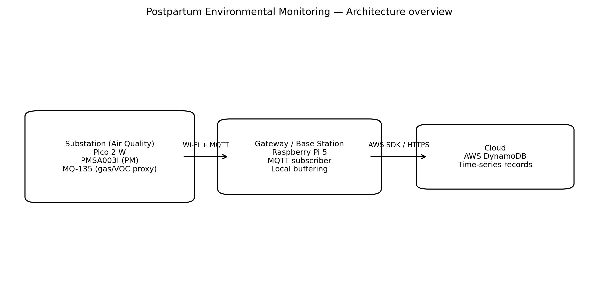
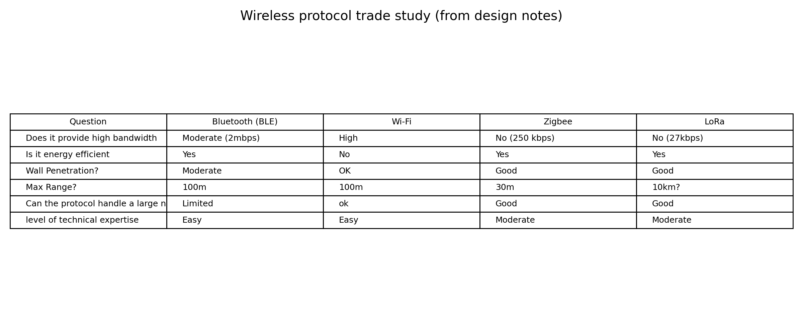
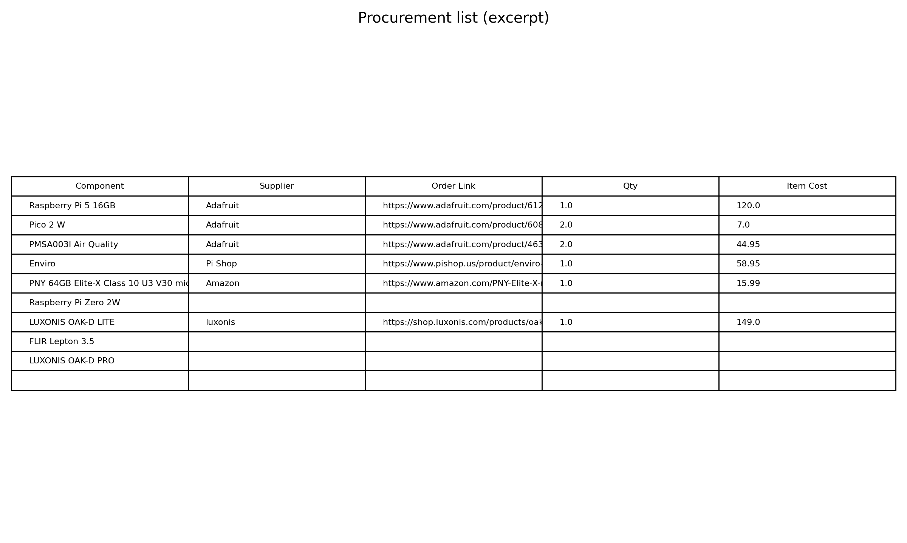
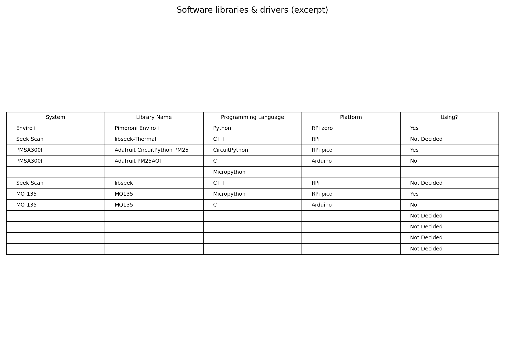
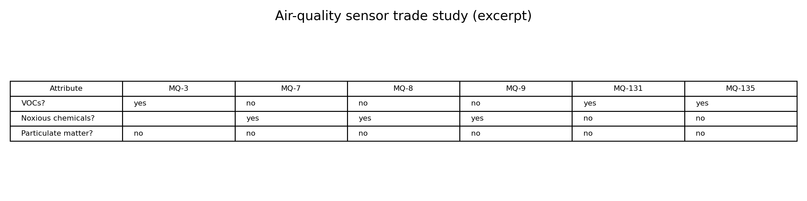

# IoT Health Monitoring — Postpartum Health Air‑Quality Node (Raspberry Pi 5 → Pico 2 W + AWS)

## TL;DR
I worked on an environmental sensing substation for a **home health monitoring** concept (postpartum recovery scenario), focusing on **air‑quality telemetry + reliable cloud logging** rather than clinical claims. The air‑quality substation runs on a **Pico 2 W** and reports to a **Raspberry Pi 5 base station**, which forwards time‑stamped records to **AWS DynamoDB**.

> **Demo / dashboard:** .
> **Code:** https://github.com/CMU-RPCS-2025/Environmental_HW_FW

---

## System architecture (multi‑substation design)
The overall system is built around a **base station** that aggregates telemetry from multiple wireless “substations” (e.g., ambient conditions/air quality, medication adherence, camera modules) and forwards data to the cloud for storage/analysis.

**Base station responsibilities**
- Wireless onboarding/handshake for substations (Bluetooth/Wi‑Fi)
- Data aggregation + local buffering
- Cloud interface (MQTT → cloud storage)

**Substation template**
Each substation follows a common structure: **MCU + wireless + battery power + sensors**, enabling independent modules that can be deployed in multiple rooms.

---

## My focus: Ambient conditions / air quality
I contributed to the **environmental hardware/firmware** workstream and integration for the air‑quality subsystem.

Two environmental approaches were explored during the project:
- **PM-focused node:** particulate matter sensing with a dedicated PM sensor and Wi‑Fi uplink to the base station
- **Enviro+ node:** multi-sensor ambient telemetry (temperature/pressure/humidity/light/noise + gas channels) sent to the base station via Wi‑Fi

### Hardware (air‑quality substation)
- **Gateway / base station:** Raspberry Pi 5  
- **Substation MCU:** Raspberry Pi Pico 2 W  
- **Particulate matter:** **PMSA003I** air quality sensor  
- **Ambient conditions (alternate node):** **Enviro+** breakout

> Note: some documentation/code paths reference “PM + CO₂” as a target. On the hardware side, the components I worked with and documented in the procurement + design notes emphasize **PM sensing + ambient conditions**; if a CO₂ sensor is present in your build, add it here with the exact part number.

---

## Wireless + messaging protocol
We ran a lightweight trade study across common protocols:

**Chosen approach:** Wi‑Fi + **MQTT** for simplicity and clean pub/sub integration with the base station.

---

## Cloud logging (AWS DynamoDB)
The base station forwards readings into DynamoDB as time-series records.
- Time-series indexing pattern: **node/device id + timestamp**
- Local buffering on the base station to reduce data loss during connectivity drops

*(If you share your exact DynamoDB key names/table name, I can make this section precise.)*

---

## Engineering work I contributed
- End-to-end sensing pipeline: sensor acquisition → packetization → wireless publish → base station ingest → cloud write
- Reliability-oriented integration: reconnect logic, buffering, and test runs for stability
- Late-phase coordination: interface agreements, tracking issues, and maintaining documentation

---

## Project artifacts (included in this repo)
These are included under `assets/postpartum/` so reviewers can inspect real engineering work.

### Procurement list (excerpt)

### Software libraries & drivers (excerpt)

### Environmental sensor trade study (excerpt)

Raw editable files:
- `assets/postpartum/design_matrices.xlsx`
- `assets/postpartum/software_libraries.xlsx`
- `assets/postpartum/procurement_list.xlsx`
- `assets/postpartum/*.drawio`

---

_Last updated: 2026-01-07_
