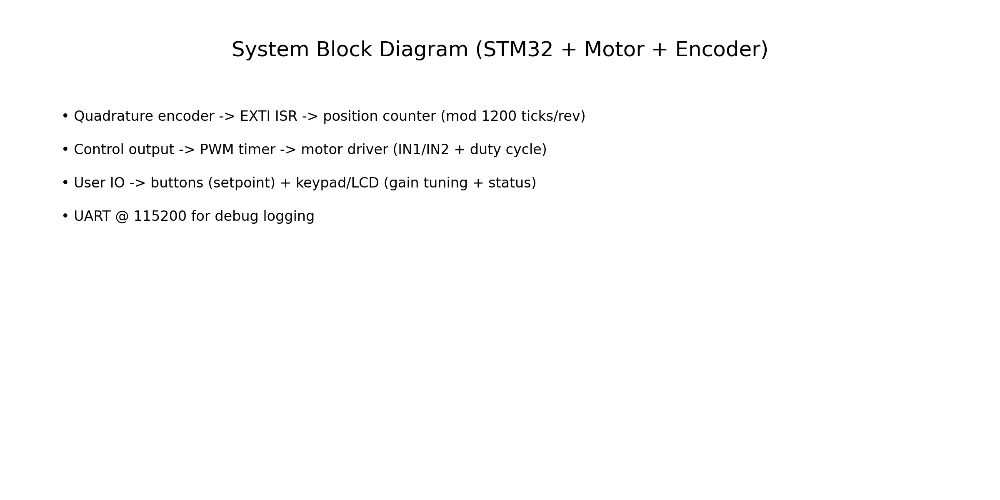
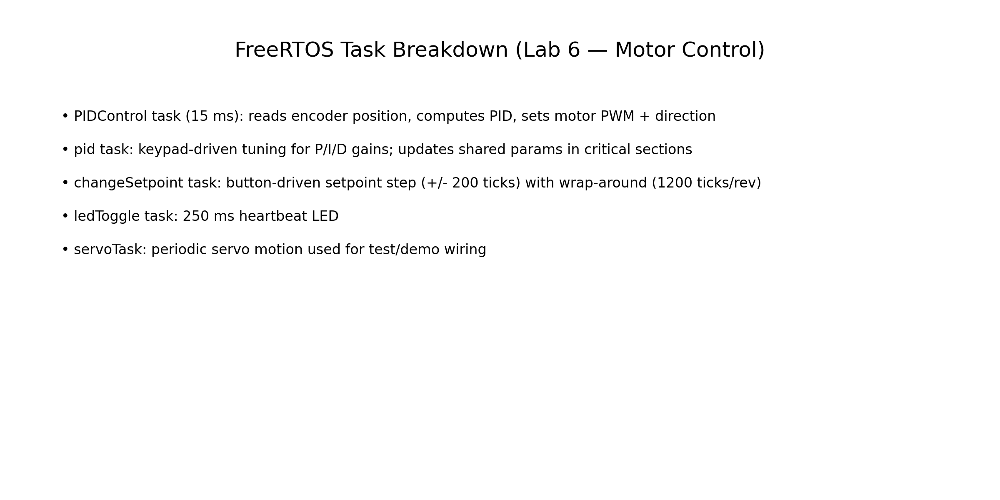

# Intro to Embedded Systems — STM32 + FreeRTOS Motor Control (18‑349 Lab 6)

## TL;DR
I implemented a **real-time motor position controller** on an STM32 using **FreeRTOS**, combining a **quadrature encoder ISR**, a **15 ms PID control loop**, and **interactive tuning** (keypad + LCD) to iteratively stabilize performance.

> **Code:** publishable as a GitHub repo (or available upon request)  
> **Demo:** no demo video — the hardware kit was returned at the end of the course, so I can’t re-record the setup. This page includes implementation details and artifacts.

---

## System architecture

### Hardware / IO (from implementation)
- **MCU:** STM32 (Cortex‑M) running **FreeRTOS**
- **Actuation:** DC motor controlled via PWM + direction pins (IN1/IN2)
- **Sensing:** quadrature encoder decoded via EXTI ISR
- **User input:** push buttons for setpoint step, keypad + LCD for tuning
- **Debug:** UART @ **115200** baud

---

## FreeRTOS design (tasks + timing)

**Tasks created (from `lab6_main`)**
- `PIDControl` — main control loop task  
- `pid` — tune P/I/D gains from keypad; show summary on LCD  
- `changeSetpoint` — adjust setpoint via buttons  
- `ledToggle` — heartbeat LED  
- `servoTask` — periodic servo movement (test/demo support)

**Key timing parameters**
- PID sample time: **15 ms** (`PID_SAMPLE_TIME_MS = 15`)
- Heartbeat LED: **250 ms**
- Button polling: **200 ms**
- LCD refresh: **1000 ms**

---

## Control loop details (PID + safety)
The PID loop reads the encoder position and computes a drive command that is clamped to avoid stalling and saturation.

**What I implemented**
- **Encoder position** tracked modulo **1200 ticks/rev**
- **Shortest-path error** with wrap-around handling (so error doesn’t “jump” across 0/rev boundary)
- Output clamping (duty cycle bounds):
  - `MIN_MOTOR_SPEED = 14`
  - `MAX_MOTOR_SPEED = 90`
- “Close enough” stop condition (deadband): if `|error| <= 30` ticks, motor stops

**Setpoint stepping**
- Buttons step setpoint by **±200 ticks** (≈ 60° per step if 1200 ticks/rev)

---

## Interactive tuning (keypad + LCD)
I implemented a small UI loop to tune PID gains live:
- Prompt for **P**, **I**, **D** sequentially on LCD
- Read digits from keypad
- Update shared gain variables inside critical sections
- Display a summary line with the current tuned values

This makes iteration fast: tune → observe response → tune again, without rebuilding firmware.

---

## What I’d improve next
- Move PID timing to a periodic timer/notification (avoid delays *inside* the PID update function)
- Add a simple serial “telemetry frame” (position, setpoint, drive) to plot step response quickly
- Add explicit anti-windup strategy tied to output saturation

---

_Last updated: 2026-01-07_
